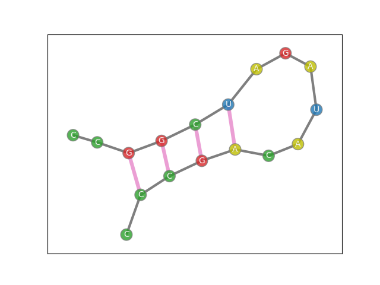
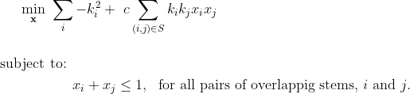

[](
  https://ide.dwavesys.io/#https://github.com/dwave-examples/rna-folding)
[](
  https://circleci.com/gh/dwave-examples/rna-folding)

# RNA Folding

In biology and chemistry, the properties of a molecule are not solely determined
by a set of atoms but also by the shape of the molecule. In genetics, the shape
of an RNA molecule is largely determined by how it bends back on itself. The
sequence of A’s, U’s, G’s, and C’s that make up RNA has certain pairs that are
drawn together to form hydrogen bonds. A sequence of several bonds in a row is
called a stem, and a stem provides sufficient force to keep the molecule folded
together. RNA molecules naturally form some stems while avoiding others in a
manner that minimizes the free energy of the system.

This demo program takes an RNA sequence and applies a quadratic model in pursuit
of the optimal stem configuration.



<p>
&emsp;&emsp;&emsp;&emsp;&emsp;&emsp;&emsp; 
Fig.1 - An RNA sequence with a single stem of length 4.
</p>

Predicting the existence of stems is important to predicting the properties of
the RNA molecule. However, prediction is complicated by two important factors. 

First, stems are not allowed to overlap. A simple case of overlapping can be
illustrated by Figure 1. The stem expressed by the pink lines can be denoted
with the tuple (2, 5, 12, 15). Here, indexing starts with 0 at the far left C
and continues along the sequence represented by the gray edges, ending with
index 16 at the bottom-most C. The indices of the eight nucleotides in the stem
are labeled in the figure. The four pink edges illustrate the four bonds that
make up the stem. While there are eight nucleotides in the stem, bonded along
pink lines, the 4-tuple completely determines the stem. However, the smaller
stems (2, 4, 13, 15) and (3, 5, 12, 14) also need to be considered, even though
the optimal solution will not include them in this case. Note that by default,
we will only consider stems with length at least 3, as smaller stems are
unlikely to form and sustain bonds.

Second, the intertwining phenomenon known as a pseudoknot is less energetically
favorable. In Figure 2, we see an example of such a pseudoknot, where one side
of a stem occurs in between the two sides of a different stem. The use of a
quadratic objective allows us to make pseudoknots less likely to occur in
optimal solutions, increasing overall accuracy. Specifically, we include a
quadratic term for each pair of stems that, if present, form a pseudoknot. The
positive coefficient on this quadratic term discourages the forming of
pseudoknots without explicitly disallowing them.

<p align = "center">


<p>
&emsp;&emsp;&emsp;&emsp;&emsp;&emsp;&emsp;
Fig.2 - A pseudoknot formed by a stem of length 3 and a stem of length 5.
</p>

This demo is loosely based on the work in [1],
which is in turn inspired by [2].

## Usage

To run the demo through a command line interface, type:

```bash
python RNA_folding.py
```

The demo prints the optimal stem configuration along with other relevant data.
It then saves a plot of the sequence and its bonds as `RNA_plot.png`.

### Optional parameters
Several optional parameters are accepted:

- `--path`: specifies the path to an input text file with RNA sequence information. 
- `--verbose`: prints additional information about the model when set to 'True' (the default). 
- `--min-stem`: minimum length necessary for a stem to be considered.
- `--min-loop`: minimum number of nucleotides that must be present
in between the two sides of a stem for that stem to be considered. 
In the literature, this is termed a 'hairpin loop.'
- `-c`: reduces the likelihood of pseudoknots by setting larger values of the coefficient, 
*ck<sub>i</sub>k<sub>j</sub>*,
applied to the quadratic pseudoknot terms.

As an example, to explicitly call the default values, type:
```bash
python RNA_folding.py --path RNA_text_files/TMGMV_UPD-PK1.txt --verbose True  --min-stem 3 --min-loop 2 -c 0.3 
```

## Problem Formulation

In predicting the stems of an RNA molecule, we build a quadratic model with three contributing factors. 

1. Each potential stem is encoded as a binary variable, 
linearly weighted by the negative square of the length, *k*.

2. Each potential pseudoknot is encoded as a quadratic term, 
 weighted by to the product of the two lengths 
times a positive parameter *c*.

3. Overlapping stems are not allowed. 
Potential overlaps give rise to constraints in the model.



Here, each *x<sub>i</sub>* is a binary variable indicating the
inclusion/exclusion of the *i<sup>th</sup>* stem. Each constant *k<sub>i</sub>*
is the length of said stem. The indexing set *S* is the set of all pairs of
stems that form a pseudoknot. Finally, *c* is a tunable parameter adjusting the
impact of pseudoknots. It is set to 0.3 by default. If *c* = 0, the affect of
pseudoknots is ignored, while *c* > 1 eliminates all pseudoknots from optimal
solutions. This formulation (and default choice of *c*) is loosely based on [1].

In the printed solution, each stem is denoted by four numbers. The first two
numbers correspond to the beginning and ending indices of the first side of the
stem. Similarly, the last two numbers correspond to the beginning and ending
indices of the second side of the stem.

## Code Overview

The implementation can be broken into three main parts
1. Preprocessing the RNA sequence to extract all possible stems, pseudoknots, and overlaps.
2. Building the model and sending it to a hybrid solver to find a solution.
3. Post-processing the solution 
to print appropriate information and create the plot.

A majority of the code is dedicated to step 1. Here, possible bonds are stored
in a binary matrix, and the matrix is searched for possible stems. Possible
stems (each corresponding to a decision variable) are stored in a dictionary
structure that reduces the number of comparisons necessary when searching for
pseudoknots and overlaps.

## Code Specifics

By default, the minimum stem length is set to 3. A stem of length 5 thus
contains two stems of length 4 and three stems of length 3 under inclusion. The
stem dictionary records the maximal stems (under inclusion) as keys, where each
key maps to a list of the associated stems weakly contained within the maximal
stem.

No two stems contained in the same maximal key can both be in an optimal
solution, so we treat them all as overlapping, regardless of if it is literally
the case. This particular case of overlapping is enforced by treating the set of
stems contained in a maximal stem as a single discrete variable by use of the
`add_discrete` method.

We further use the stem dictionary structure to avoid comparing all combinations
of stems when searching for pseudoknots and overlaps.

Plotting uses a randomized process to find a reasonable layout. For this reason,
the plot will change in successive runs, even if the solution does not. 

Input text files should have a number at the beginning of each line, followed by
a sequence of A, C, G, U, and T's. The file reader ignores the leading number
and is not sensitive to spaces, upper vs. lower case, or line breaks. By
convention, spaces are used to separate every 10 letters and the number at the
beginning of each line is included to keep track of the location in the
sequence. For instance, if there are 30 letters on each line, then there would
be three groups of 10 letters on each line, with the leading numbers increasing
by 30 each line.

## References

[1] Fox DM, MacDermaid CM, Schreij AM, Zwierzyna M, Walker RC. 
"RNA folding using quantum computers," 
[PLOS Computational Biology](https://journals.plos.org/ploscompbiol/article?id=10.1371/journal.pcbi.1010032).

[2] Kai, Zhang, et al. 
"An efficient simulated annealing algorithm for the RNA secondary structure prediction with Pseudoknots," 
[BMC Genomics](https://bmcgenomics.biomedcentral.com/articles/10.1186/s12864-019-6300-2).
